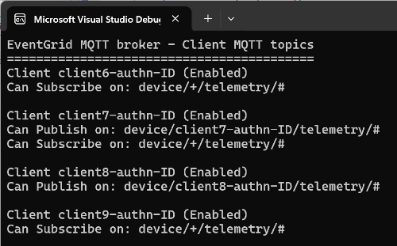

# EventGrid namespace MQTT support, topics per client overview

Demonstrator with an overview of Azure EventGrid namespace device clients and their topics.

It combines all clients, client groups, topic spaces, and permission bindings found in your MQTT broker and outputs a list of clients, each with its own topics:



The code behind this demonstration is available under an MIT license so you can use it in your own projects too.

## Walk-through

This [blog post](https://sandervandevelde.wordpress.com/2024/05/21/eventgrid-namespace-mqtt-support-topics-per-client-overview/) offers you a detailed walk-through on how to use this repo. 

## Prerequisites

The application needs both access to the EventGrid namespace resource and authorization.

### EventGrid namespace resource settings

An example of the EventGrid namespace settings looks like:  

```
string subscriptionId = "de442b11-d1e5-4655-aa8f-84011ad41d44";
string resourceGroupName = "iotgrid-demo-rg";
string namespaceName = "iotgrid-basic-egns";
```

Notice that three environment variables are used by the application to read the values from your system:

```
mqtt-graph-subscriptionid
mqtt-graph-resourcegroupname
mqtt-graph-namespacename
```

### Authorization

Next to the settings authorization to the Azure Portal / Arm resources is needed.

The authorization using the Azure CLI is demonstrated for retrieving credentials:

```
// Use CLI access via AZ LOGIN 
var cred = new DefaultAzureCredential(new DefaultAzureCredentialOptions { ExcludeSharedTokenCacheCredential = true });
ArmClient client = new ArmClient(cred);
```

These lines make use of the Azure portal/arm access via credentials stored in the Azure CLI.

So, log in on the Dos prompt via:

```
az login
```

Run the application (it can take a couple of seconds or more to be constructed).

## Unit tests for the device client queries

A custom parser for the device client query is written, due to an omission in the underlying NuGet Arm library.

The unit tests prove the correct support for a limited number of scenarios.

These example query formats are supported:

```
// attributes.type IN ['audit']
// attributes.type IN ['audit', 'a', 'AA', 99]
// attributes.type in ['audit']
// attributes.type in ['audit', 'a', 'AA', 99]
// attributes.type = "audit"
// attributes.type != "audit"
// attributes.type <> "audit"
```

## Contributions

At this moment, the custom query parser does not support integers, '> >= < <=', 'and', 'or', parenthesis.

Contributions for better query support are welcome.
